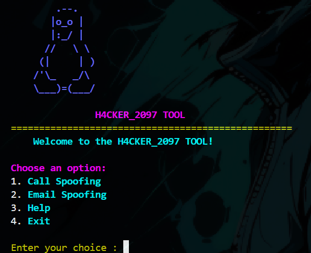
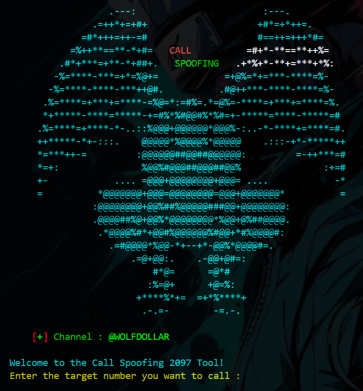

# SPOOFING 2097
### A powerful tool for SPOOFING  ⚠️

### Menu :


#### This tool uses the following methods spoof :
* call 🔆
* email 🔆
* sms 🔆

### CALL SPOOFING


### EMAIL SPOOFING


### Report SMS [updating]
- It is currently being updated

## tip

- If you accidentally SPOOF something, your account will be reported! ❌
- Report any violation you see accordingly
- Any crime committed with this tool is the responsibility of the user ❌
- This is a trial version! ♨️

## Description

### Modules used: 
If installed , pip install {name}
------------------------------------
- telethon 🔰
- prettytable 🔰
- colorama (Required for Windows) 🤓
------------------------------------

## Support from
- Linux ✅
- Windows ✅
- Termux ✅

## Install :

```
git clone https://github.com/esfelurm/Reporter-Telegram
cd Reporter-Telegram
python main.py
```
### this 

Goodbye my friends 
